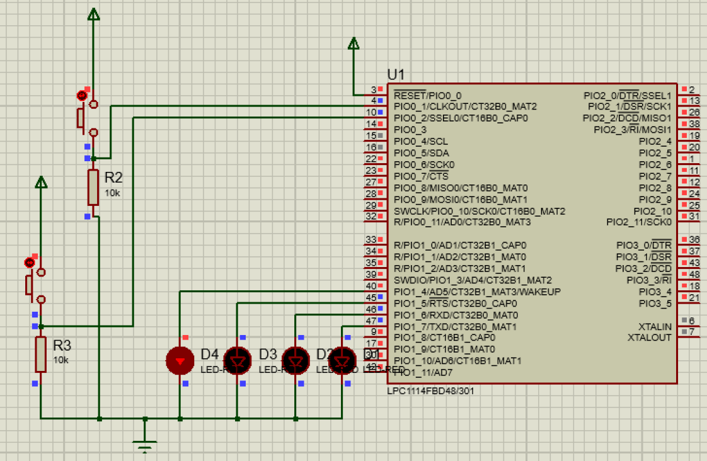

# Embedded Systems - Task 2
## LED Rotation Project

This project implements a bit-rotating logic using an **ARM Cortex-M0** microcontroller. 

### Features:
* **Shift Right:** When the button on `GPIO0.1` is pressed, the active LED moves to the right.
* **Shift Left:** When the button on `GPIO0.2` is pressed, the active LED moves to the left.
* **Debouncing:** A software delay is implemented to ensure stable button presses.

### Files:
* `main.c`: The C source code for the microcontroller.
* `Embedded_Task2_Ghena.pdsprj`: The Proteus simulation circuit.

